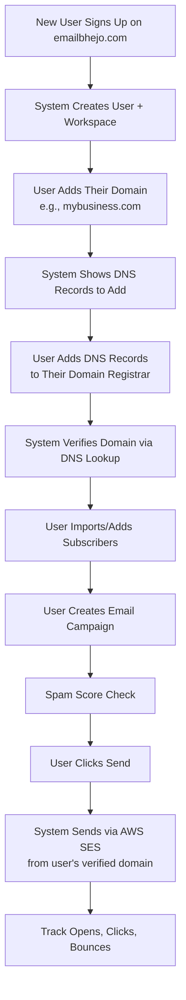

# 🚀 AWS SES Multi-Tenant Setup Guide for EmailBhejo.com

> [!IMPORTANT]
> This guide covers everything you need to do — from AWS Console setup to code changes — to make your app production-ready with multi-tenant email broadcasting via AWS SES.

---

## 📋 Overview — What We Need To Do

| # | Task | Where | Time |
|---|------|-------|------|
| 1 | Verify domain `emailbhejo.com` in AWS SES | AWS Console | 10 min |
| 2 | Add DNS records (DKIM, SPF, DMARC) to your domain registrar | Domain DNS Panel | 15 min |
| 3 | Request SES Production Access (exit sandbox) | AWS Console | 24-48 hrs |
| 4 | Create IAM User with SES permissions | AWS Console | 5 min |
| 5 | Update your `.env` with AWS credentials | Your Code | 2 min |
| 6 | Fix the email dispatcher to use SES (not SNS) | Your Code | I'll do this |
| 7 | Make campaign sending use workspace subscribers | Your Code | I'll do this |
| 8 | Fix auth middleware for production security | Your Code | I'll do this |

---

## 🔴 CRITICAL ISSUE IN YOUR CURRENT CODE

Your `emailDispatcher.ts` uses **AWS SNS** (Simple Notification Service) instead of **AWS SES** (Simple Email Service). SNS is for push notifications/SMS, NOT for sending marketing emails. **I will fix this for you** after you complete the AWS setup steps below.

Also, your `sendCampaign` only sends to a single hardcoded recipient — it doesn't broadcast to all workspace subscribers. **I will fix this too.**

---

## PHASE 1: AWS Console Setup (You Do This)

### Step 1: Verify Your Domain in AWS SES

1. **Go to AWS SES Console**: [https://console.aws.amazon.com/ses](https://console.aws.amazon.com/ses)
2. **Select Region**: Choose `ap-south-1` (Mumbai) since you're in India — this gives lower latency. Or use `us-east-1` if you prefer.
3. Click **"Verified identities"** in the left sidebar
4. Click **"Create identity"**
5. Select **"Domain"**
6. Enter: `emailbhejo.com`
7. Check ✅ **"Use a custom MAIL FROM domain"** and enter: `mail.emailbhejo.com`
8. Under **"Advanced DKIM settings"**: select **"Easy DKIM"** → Key length **2048-bit** → Enable **"DKIM signing"**
9. Click **"Create identity"**

> [!NOTE]
> After creating, AWS will show you DNS records that you MUST add to your domain. Copy them carefully.

### Step 2: Add DNS Records to Your Domain

Go to wherever you manage DNS for `emailbhejo.com` (GoDaddy, Namecheap, Cloudflare, etc.) and add these records:

#### A. DKIM Records (3 CNAME records — AWS gives you these)

AWS will generate 3 CNAME records that look like:

| Type | Name | Value |
|------|------|-------|
| CNAME | `abc123._domainkey.emailbhejo.com` | `abc123.dkim.amazonses.com` |
| CNAME | `def456._domainkey.emailbhejo.com` | `def456.dkim.amazonses.com` |
| CNAME | `ghi789._domainkey.emailbhejo.com` | `ghi789.dkim.amazonses.com` |

> Copy the exact values from your AWS SES console — the above are examples.

#### B. SPF Record (TXT record)

| Type | Name | Value |
|------|------|-------|
| TXT | `emailbhejo.com` | `v=spf1 include:amazonses.com ~all` |

> If you already have an SPF record, just add `include:amazonses.com` before `~all`.

#### C. MAIL FROM MX Record

| Type | Name | Value | Priority |
|------|------|-------|----------|
| MX | `mail.emailbhejo.com` | `feedback-smtp.ap-south-1.amazonses.com` | 10 |
| TXT | `mail.emailbhejo.com` | `v=spf1 include:amazonses.com ~all` | — |

> Replace `ap-south-1` with your chosen AWS region.

#### D. DMARC Record (TXT record)

| Type | Name | Value |
|------|------|-------|
| TXT | `_dmarc.emailbhejo.com` | `v=DMARC1; p=none; rua=mailto:info@emailbhejo.com; sp=none; aspf=r` |

> Start with `p=none` (monitor mode). Change to `p=quarantine` or `p=reject` later after confirming deliverability.

#### E. Return-Path / Custom MAIL FROM SPF

| Type | Name | Value |
|------|------|-------|
| TXT | `mail.emailbhejo.com` | `v=spf1 include:amazonses.com ~all` |

### Step 3: Wait for Verification

- Go back to **AWS SES → Verified identities → emailbhejo.com**
- DNS propagation takes **5 min to 72 hours** (usually 15-30 minutes)
- Refresh the page — all statuses should turn ✅ **Verified**

### Step 4: Also Verify Your Email Identity

1. In SES Console → **"Verified identities"** → **"Create identity"**
2. Select **"Email address"**
3. Enter: `info@emailbhejo.com`
4. Click "Create identity"
5. Check your inbox and click the verification link

> [!TIP]
> Verifying the email is needed while you're in SES Sandbox mode. Once you get production access, you only need the domain verified.

---

## PHASE 2: Exit the SES Sandbox (CRITICAL!)

> [!CAUTION]
> **By default, AWS SES is in "Sandbox" mode** — you can ONLY send emails to verified email addresses. To send to real users/subscribers, you MUST request production access.

### Step 5: Request Production Access

1. Go to **AWS SES Console** → **"Account dashboard"**
2. Look for **"Your account is in the Amazon SES sandbox in ..."**
3. Click **"Request production access"**
4. Fill the form:

| Field | Value |
|-------|-------|
| **Mail type** | Marketing |
| **Website URL** | `https://emailbhejo.com` |
| **Use case description** | Write this 👇 |

**Use case description (copy-paste this):**

```
We operate EmailBhejo.com, a multi-tenant email marketing SaaS platform. Our customers 
(businesses) onboard through our platform, verify their own sending domains, import their 
opt-in subscriber lists, and send email campaigns/newsletters to their subscribers.

We implement the following best practices:
- Double opt-in for all subscriber lists
- One-click unsubscribe headers in every email (RFC 8058)
- Automatic bounce and complaint handling via SES notifications
- Sending rate limits per tenant
- Content quality checks (spam score) before sending

Expected sending volume: 1,000-10,000 emails/day initially, scaling to 50,000/day.
We will monitor bounce rates (<5%) and complaint rates (<0.1%) closely.
```

| **Additional contacts** | `info@emailbhejo.com` |
| **Preferred contact language** | English |

5. Submit the request
6. **Wait 24-48 hours** for AWS approval

> [!WARNING]
> If AWS rejects your request, they'll tell you why. You may need to provide more details about your anti-spam measures. Don't worry — resubmit with more info.

---

## PHASE 3: Create IAM Credentials

### Step 6: Create an IAM User for SES

1. Go to **AWS IAM Console**: [https://console.aws.amazon.com/iam](https://console.aws.amazon.com/iam)
2. Click **"Users"** → **"Create user"**
3. Username: `emailbhejo-ses-sender`
4. Click **"Next"**
5. Select **"Attach policies directly"**
6. Search for and attach: **`AmazonSESFullAccess`**
7. Click **"Next"** → **"Create user"**

### Step 7: Generate Access Keys

1. Click on the user `emailbhejo-ses-sender`
2. Go to **"Security credentials"** tab
3. Under **"Access keys"** → Click **"Create access key"**
4. Select **"Application running outside AWS"**
5. Click **"Create access key"**
6. **COPY BOTH VALUES NOW** (you won't see the secret again):
   - `Access key ID`: e.g., `AKIA...`
   - `Secret access key`: e.g., `wJalr...`

> [!CAUTION]
> Save these securely! The secret access key is shown only once. If you lose it, you'll need to create new keys.

---

## PHASE 4: Update Your Application (.env)

### Step 8: Update `backend/.env`

Open [.env](file:///d:/email%20marketing%20tool/backend/.env) and update:

```env
# Switch to AWS SES
EMAIL_PROVIDER=AWS

# AWS SES Credentials
AWS_REGION=ap-south-1
AWS_ACCESS_KEY_ID=AKIA_YOUR_ACCESS_KEY_HERE
AWS_SECRET_ACCESS_KEY=YOUR_SECRET_KEY_HERE

# Default sender (must be verified domain/email)
SES_FROM_EMAIL=info@emailbhejo.com
SES_FROM_NAME=EmailBhejo
```

> [!IMPORTANT]
> Replace `AKIA_YOUR_ACCESS_KEY_HERE` and `YOUR_SECRET_KEY_HERE` with the actual keys from Step 7.

---

## PHASE 5: Code Changes I Will Make For You

After you complete the AWS setup above and confirm, I will make these code changes:

### 1. 🔧 Replace SNS with SES in Email Dispatcher
- Replace `@aws-sdk/client-sns` with `@aws-sdk/client-sesv2`
- Send proper HTML emails via SES API (not SNS publish)

### 2. 📨 Fix Campaign Broadcasting
- `sendCampaign` will fetch ALL active subscribers in the workspace
- Send to each subscriber (with rate limiting to stay within SES limits)
- Track actual sent count, bounce handling

### 3. 🔒 Fix Auth Middleware for Production
- Remove the dev fallback that bypasses authentication
- Return 401 for invalid/missing tokens

### 4. 🏢 Per-Tenant SES Configuration
- Each workspace can optionally store their own AWS SES credentials
- If a workspace has no SES credentials, fall back to platform-level SES
- This enables true multi-tenant: each customer uses their own verified domain

### 5. 📧 Unsubscribe Header
- Add `List-Unsubscribe` header to every outgoing email (required by Gmail/Yahoo 2024 rules)
- Create unsubscribe endpoint

---

## PHASE 6: Multi-Tenant User Flow

Here's how the complete flow works once everything is set up:



---

## 📊 Cost Estimation

| Volume | AWS SES Cost | Notes |
|--------|-------------|-------|
| First 62,000 emails/month | **FREE** | If sent from EC2 |
| After that | **$0.10 per 1,000 emails** | Very cheap |
| 100,000 emails/month | ~$3.80 | |
| 500,000 emails/month | ~$43.80 | |
| 1,000,000 emails/month | ~$93.80 | |

> Plus $0.12/GB for attachments (if any)

---

## ✅ Checklist — Complete These Steps In Order

- [ ] **Step 1**: Verify `emailbhejo.com` domain in AWS SES Console
- [ ] **Step 2**: Add all DNS records (DKIM, SPF, DMARC, MAIL FROM)
- [ ] **Step 3**: Wait for DNS verification (check SES console)
- [ ] **Step 4**: Verify `info@emailbhejo.com` email identity
- [ ] **Step 5**: Request SES Production Access (exit sandbox)
- [ ] **Step 6**: Create IAM user `emailbhejo-ses-sender`
- [ ] **Step 7**: Generate and save Access Keys
- [ ] **Step 8**: Update `backend/.env` with AWS credentials
- [ ] **Step 9**: Tell me "done" and I'll update all the code

---

## ❓ Quick FAQ

**Q: Which AWS region should I use?**
A: Use `ap-south-1` (Mumbai) for lowest latency from India. However, `us-east-1` has the most features and is the most battle-tested. Either works.

**Q: Can tenants use their own domains?**
A: Yes! Each workspace has their own domain verification. They add DNS records, your system verifies, and emails go out from their domain.

**Q: What if I'm still in SES Sandbox?**
A: You can only send to verified emails. For testing, verify your own email and your test recipients' emails in SES Console → Verified identities.

**Q: How long does production access take?**
A: Usually 24-48 hours. Sometimes same day. Provide a good use case description.

**Q: Do I need to deploy to AWS EC2?**
A: No. You can run your backend anywhere (your computer, any VPS, Vercel, Railway). AWS SES is just an API — you call it from wherever your server runs. But hosting on EC2 gives you 62,000 free emails/month.

---

> [!TIP]
> **Start with Steps 1-4 right now.** Step 5 (production access) takes time, so submit it early. While waiting, you can test with verified email addresses in sandbox mode.
